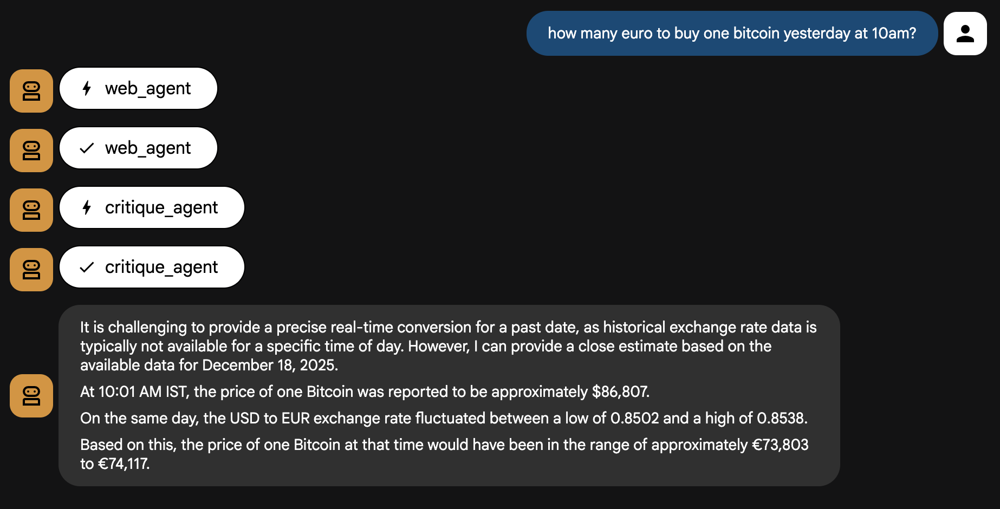
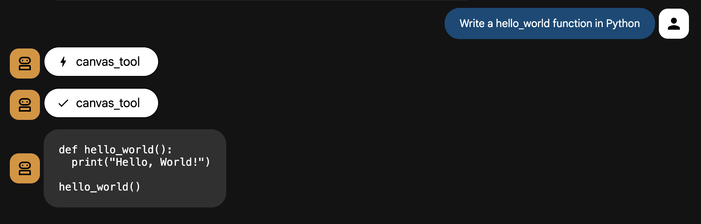
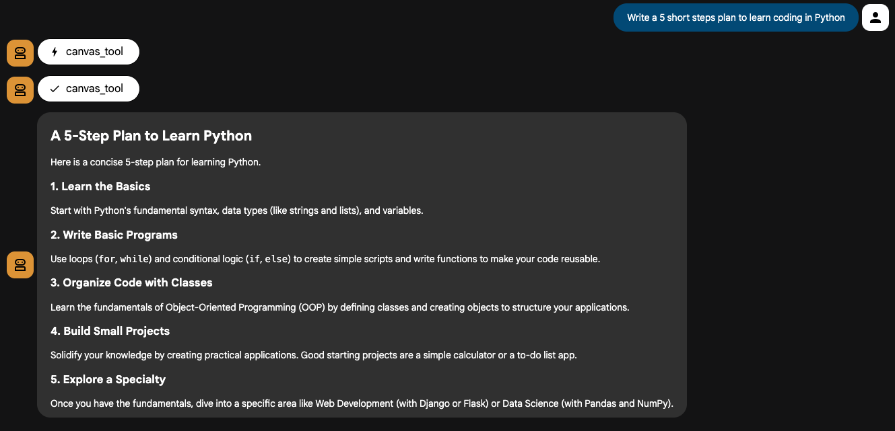

# Advanced Autonomous Research Agent (AARA)
This project implements an advanced, multi-agent autonomous research system built using the **Google Agent Development Kit (ADK)** and **Gemini 2.5 Flash/Pro**. 
It is designed to autonomously conduct research, synthesize information from multiple sources, and generate high-quality, professional documents.

AARA operates within an autonomous feedback loop, enabling agents to plan research objectives, gather and validate data, evaluate outputs, and iteratively refine results. Specialized agents collaborate to handle discovery, verification, synthesis, and document generation.

## System Architecture
The system follows a modular **"Plan-Execute-Critique-Refine"** architecture. It leverages a root orchestrator to manage specialized sub-agents and tools.

### Core Agents & Components:

**Root Agent** (Orchestrator): The brain of the system. It handles high-level planning, delegates tasks to specialized agents, and manages the state of the research loop.

**Finance Agent** (MCP Integration): Retrieves structured, real-time data for stocks, crypto, and currencies. It interfaces with an MCP (Model Context Protocol) server to fetch data from verified financial sources like Yahoo Finance.

**Web Agent**: Performs broad internet searches to gather public information and real-time news.

**RAG Agent**: Utilizes FAISS for in-memory vector search to query private, local knowledge bases.

**Critique Agent**: Acts as the quality gate. It evaluates the logic and completeness of the synthesized answer, providing actionable feedback for the next iteration.

## Key Features & Phases
### 1. Multi-Source Synthesis
The agent intelligently switches between local documents (RAG), live web data, and structured financial feeds. The Synthesizer component resolves conflicts between these sources to produce a unified response.

### 2. Autonomous Refinement Loop

Unlike linear RAG systems, this agent features a self-critique loop.

- **Plan**: Identify necessary information.
- **Execute**: Gather data via sub-agents.
- **Critique**: The critique_agent identifies gaps or logic errors.
- **Refine**: If the quality threshold isn't met, the agent loops back to the planning phase to fill gaps.


First, an agent searches for historical information on the internet. Then, the critic agent checks if the agent correctly answered the user's question.



### 3. Canvas Tool (Output Generation)
The Canvas Tool handles the final presentation layer. It transforms raw research data into professional Markdown reports, HTML documents, or validated code snippets using structured templates.

Code formatting:



Markdown formatting:



## Installation & Setup
1. Clone the repository:

```Bash
git clone https://github.com/metrych-creator/agentAI.git
cd agentAI
```
2. Create virtual environment and install dependencies from `requirements.txt`

3. Set up Environment Variables: Create a .env file with your GCP Project ID and credentials.
   
```
GCP_PROJECT_ID=[PROJECT_NAME]
GCP_LOCATION=[LOCATION]
```

4. Run the MCP Server (Docker):
   
```Bash
docker pull mcp/fetch-server
docker run -p 8080:8080 mcp/fetch-server
```

5. Launch the ADK Web Interface
   
```
adk web
```
